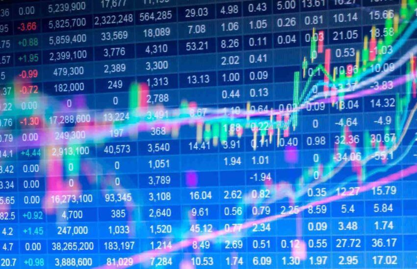

Certainly! Below is a sample README file for your stock prediction project. You can adjust it according to your specific requirements and preferences.

---

# Stock Forecast App



## Table of Contents

- [Overview](#overview)
- [Features](#features)
- [Installation](#installation)
- [Usage](#usage)
- [Components](#components)
- [Contributing](#contributing)

## Overview

The Stock Forecast App is a web application that predicts future stock prices using the Prophet forecasting model. The app allows users to select from a list of popular companies, visualize historical stock data, and generate future stock price predictions.

## Features

- **Select Stock**: Choose a stock from a predefined list of popular companies.
- **Historical Data**: View historical stock prices with interactive plots.
- **Future Prediction**: Forecast future stock prices using the Prophet model.
- **Interactive Components**: Explore different components of the forecast including trend, seasonality, and holidays.
- **Customizable Forecast Horizon**: Set the prediction period up to 5 years.

## Installation

To run the Stock Forecast App locally, follow these steps:

1. **Clone the repository**:
    ```bash
    git clone https://github.com/your_username/stock-forecast-app.git
    cd stock-forecast-app
    ```

2. **Create a virtual environment**:
    ```bash
    python -m venv venv
    source venv/bin/activate  # On Windows, use `venv\Scripts\activate`
    ```

3. **Install the dependencies**:
    ```bash
    pip install -r requirements.txt
    ```

4. **Run the app**:
    ```bash
    streamlit run app.py
    ```

## Usage

1. Launch the app by running `streamlit run app.py`.
2. Use the dropdown menu to select a company for prediction.
3. Adjust the slider to set the prediction period (in years).
4. View the raw historical data and the forecasted stock prices.
5. Explore the different components of the forecast to understand the contributing factors.

## Components

The app provides various components to help understand the stock price predictions:

- **Trend**: Shows the long-term direction of stock prices.
- **Seasonality**: Highlights repeating patterns in the stock data.
- **Holidays**: Displays the impact of holidays on stock prices.
- **Extra Regressors**: If any additional regressors are used, their effects are shown.

## Contributing

Contributions are welcome! If you have suggestions or improvements, please create a pull request or submit an issue.


